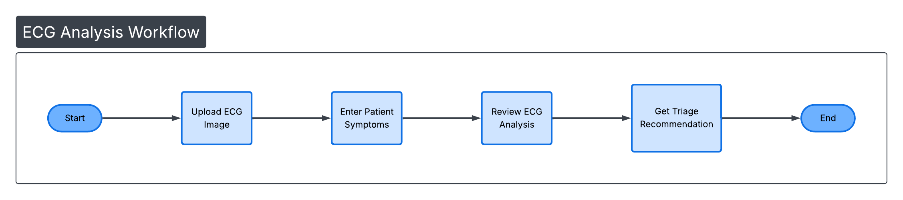

# theMedGemma_heckatn
***
[Go to english description](#MVP-Objectives)
***
**1. Założenia MVP**

**Cel:** wspiera lokalnych pracowników medycznych w podejmowaniu decyzji klinicznych, offline, prywatnie.

**Użytkownik:** pielęgniarka / lekarz w małej przychodni / terenowa opieka zdrowotna

**Dane wejściowe:**
* podstawowe informacje o pacjencie (wiek, płeć, choroby przewlekłe)
* objawy (tekst lub wybór z listy)
* opcjonalnie: podstawowe wyniki badań (temperatura, ciśnienie, saturacja, laboratoria)
* 
**Dane wyjściowe:**
* lista możliwych przyczyn (DDx) z poziomem pewności
* sygnalizacja red flags → natychmiast skierować do szpitala
* zalecenia do monitorowania lub dalszej diagnostyki

**Flow:**

Użytkownik loguje się lokalnie (opcjonalnie offline, np. tablet/laptop)
Wprowadza pacjenta i objawy
MedGemma generuje możliwe diagnozy i alerty
System pokazuje:
czerwone flagi (red flags) → natychmiastowa akcja
DDx z prawdopodobieństwem
zalecenia do monitorowania / dalszych badań
Możliwość eksportu raportu (PDF lub lokalny zapis)

## MVP Objectives
