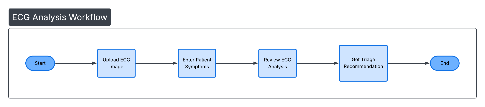

# Rural Cardiac Triage Assistant

AI-powered decision support for early cardiac risk detection in rural settings.

⚠️ This application is a clinical decision support prototype and does not diagnose or rule out myocardial infarction.

## How it works

1. Upload ECG image
2. Enter patient symptoms
3. Review ECG analysis
4. Get triage recommendation

Built using MedGemma (HAI-DEF) and Streamlit.

📌 Licence: Apache 2.0
